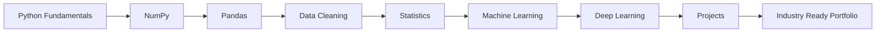

# 🚀 Machine Learning Journey

<div align="center">


<br>


</div>

---

# 🌟 About This Repository


This repository documents my journey of learning:

* 🤖 Machine Learning
* 📊 Data Science
* 🧠 Artificial Intelligence
* 🐍 Python Programming
* 📈 Data Visualization
* 🔬 Statistics & Mathematics

### ✨ What You'll Find

* 📚 Daily Learning Notes
* 🧠 ML Algorithms Implementation
* 📊 Data Analysis Projects
* 📈 Visualization Dashboards
* 🔥 Mini Projects
* 🚀 Real World Case Studies

---

# ⚡ Tech Stack

<div align="center">


<br><br>


</div>

---

# 🎯 Learning Roadmap



---

# 📚 Machine Learning Roadmap

### ✅ Completed

* Python Fundamentals
* NumPy
* Pandas
* Matplotlib
* Statistics
* Linear Regression
* KNN
* K-Means

### 🚧 In Progress

* Decision Trees
* Random Forest
* SVM
* Naive Bayes

### 🔥 Upcoming

* Deep Learning
* NLP
* Computer Vision
* Generative AI
* LLM Applications

---

# 📂 Repository Structure

```text
Machine-Learning-Journey/
│
├── 📁 Python_Fundamentals
├── 📁 NumPy
├── 📁 Pandas
├── 📁 Data_Visualization
├── 📁 Statistics
├── 📁 Machine_Learning
│
├── 📁 Projects
├── 📁 Datasets
├── 📁 Images
│
└── README.md
```

---

# 📈 Progress Tracker

| Topic            | Progress        |
| ---------------- | --------------- |
| Python           | ██████████ 100% |
| NumPy            | ██████████ 100% |
| Pandas           | ██████████ 100% |
| Statistics       | █████████░ 90%  |
| Machine Learning | ███████░░░ 70%  |
| Deep Learning    | ██░░░░░░░░ 20%  |

---

# 📊 GitHub Analytics

<div align="center">


<br>


</div>

---

# 📈 Contribution Graph

<div align="center">


</div>

---

# 🧠 Skills Matrix

| Category         | Skills                                 |
| ---------------- | -------------------------------------- |
| Programming      | Python                                 |
| Data Analysis    | NumPy, Pandas                          |
| Visualization    | Matplotlib                             |
| Machine Learning | Regression, Classification, Clustering |
| Tools            | Git, GitHub, VS Code, Jupyter          |

---

# 🚀 Future Projects

### 🏠 House Price Prediction

### 📄 Resume Screening System

### 🎬 Movie Recommendation System

### 👩‍🎓 Student Performance Prediction

### 🏢 Employee Attrition Prediction

### 🤖 AI Interview Assistant

### 📈 Stock Market Prediction

---

# 🏆 2026 Goals

* ✅ Complete Machine Learning
* 🚀 Learn Deep Learning
* 🤖 Build AI Projects
* 📊 Create Portfolio Projects
* 🎯 Crack ML/QA/Data Analyst Interviews
* 💼 Land a Tech Role

---

# 🤝 Connect With Me

<div align="center">

<a href="https://github.com/Shrutisinha">

</a>

<a href="https://www.linkedin.com">

</a>

</div>

---

# 🐍 Contribution Snake

<div align="center">


</div>

---

<div align="center">

## ⭐ Thanks For Visiting!


### 🚀 Keep Learning • Keep Building • Keep Growing

</div>
