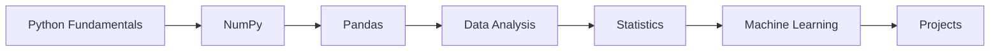

# 🚀 Machine Learning Journey
```html
<div align="center">


<br>


</div>
```

<div align="center">


<br>


</div>

---

<div align="center">

### 🌟 From Python Basics to Machine Learning Models

*"Every notebook in this repository represents a step forward in my learning journey."*

</div>

---

# 🎯 About This Repository

This repository documents my hands-on journey of learning **Machine Learning, Data Analysis, Statistics, and Python** through practical implementation and continuous experimentation.

It serves as a collection of notebooks, exercises, and mini-projects that help strengthen my understanding of data-driven problem solving.

---

## ✨ What You'll Find Here

🔹 Daily learning notebooks

🔹 Python programming concepts

🔹 Data Analysis workflows

🔹 Statistics fundamentals

🔹 Data Visualization examples

🔹 Machine Learning algorithms

🔹 Practice datasets and experiments

🔹 Mini projects for concept reinforcement

---

# ⚙️ Tech Stack

<div align="center">


</div>

---

## 📚 Libraries & Tools

<p align="center">


</p>

---

# 🛣️ Learning Roadmap



---

## 🐍 Python Fundamentals

✔ Variables

✔ Loops

✔ Functions

✔ Object-Oriented Programming (OOP)

---

## 📊 Data Analysis

✔ NumPy

✔ Pandas

✔ Data Cleaning

✔ Feature Engineering Basics

---

## 📈 Statistics

✔ Mean

✔ Median

✔ Mode

✔ Variance

✔ Standard Deviation

✔ Correlation

✔ Covariance

---

## 🤖 Machine Learning

✔ Linear Regression

✔ Logistic Regression

✔ KNN

✔ K-Means Clustering

✔ Decision Trees

✔ Random Forest

✔ Support Vector Machine (SVM)

✔ Naive Bayes

---

# 📂 Repository Structure

```text
Machine-Learning-Journey/
│
├── Day01_NumPy_Basics.ipynb
├── Day02_Pandas_Basics.ipynb
├── Day03_Matplotlib.ipynb
├── Day04_Statistics.ipynb
├── Day05_Linear_Regression.ipynb
├── Day06_KNN.ipynb
├── Day07_KMeans.ipynb
├── Day08_Decision_Tree.ipynb
├── Day09_Random_Forest.ipynb
├── Day10_SVM.ipynb
│
├── datasets/
├── images/
└── README.md
```

---

# 📈 Progress Tracker

| Day    | Topic             | Progress      |
| ------ | ----------------- | ------------- |
| Day 01 | NumPy Basics      | ✅ Completed   |
| Day 02 | Pandas Basics     | ✅ Completed   |
| Day 03 | Matplotlib        | ✅ Completed   |
| Day 04 | Statistics        | ✅ Completed   |
| Day 05 | Linear Regression | ✅ Completed   |
| Day 06 | KNN               | ✅ Completed   |
| Day 07 | K-Means           | ✅ Completed   |
| Day 08 | Decision Tree     | ⏳ In Progress |
| Day 09 | Random Forest     | ⏳ In Progress |
| Day 10 | SVM               | ⏳ In Progress |

---

# 📚 Topics Covered

## 🔢 NumPy

* Arrays
* Matrix Operations
* Dot Product
* Cross Product
* Transpose
* Inverse

---

## 🐼 Pandas

* Series
* DataFrames
* CSV Handling
* Data Cleaning

---

## 📈 Statistics

* Mean
* Variance
* Standard Deviation
* Correlation
* Covariance

---

## 🤖 Machine Learning

* Classification
* Regression
* Clustering
* Model Evaluation

---

# 🚀 Future Projects

These are the projects I plan to work on as I continue learning:

* House Price Prediction
* Resume Screening System
* Employee Attrition Prediction
* Student Performance Prediction
* Movie Recommendation System

---

# 🎯 Goals

```text
✓ Strengthen Python Skills
✓ Build Strong ML Foundations
✓ Improve Data Analysis Skills
✓ Work on Practical Projects
✓ Prepare for Technical Interviews
✓ Build a Strong Portfolio
```

---

# 📊 GitHub Statistics

<div align="center">


</div>

---

# 🌱 Current Focus

```python
Learning = {
    "Python": "Improving",
    "Data Analysis": "Practicing",
    "Statistics": "Learning",
    "Machine Learning": "Exploring",
    "Projects": "Building"
}
```

---

# 🤝 Connect With Me

### GitHub

👉 https://github.com/Shrutisinha

---

<div align="center">

## ⭐ If you find this repository interesting, consider giving it a star!


</div>
